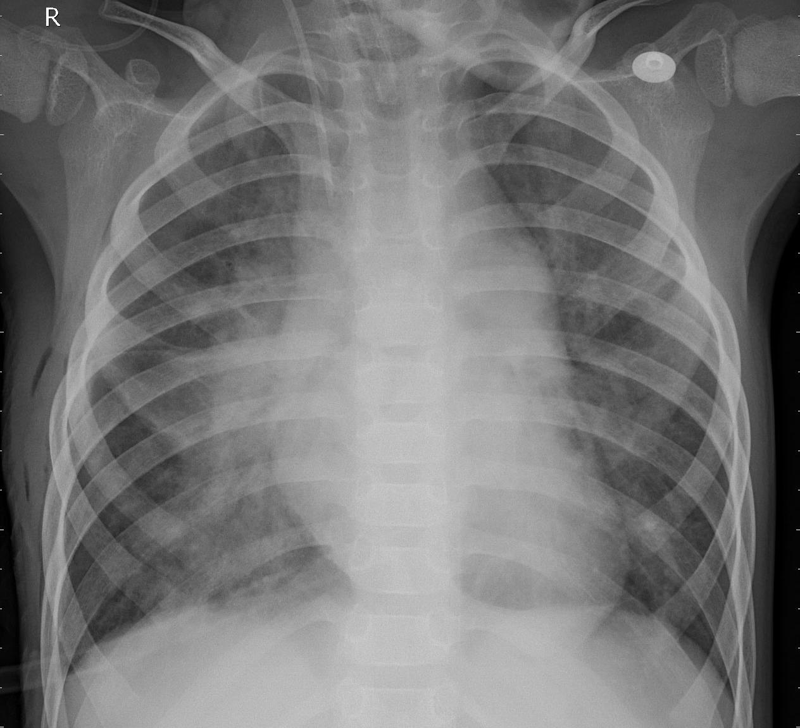

# CECS 456 Final Project
Final project for CSULB CECS-456 Machine Learning class.

With this project, we aim to train a convolutional neural network model to detect pneumonia in x-ray images of a patient’s lungs. We train on the Kaggle dataset “Chest X-Ray Images (Pneumonia)”. The goal of our project is to determine, given an X-Ray, whether the X-Ray belongs to the ‘Normal’ or ‘Pneumonia’ class. Notice we have to determine if an image is a part of one class or another, there is no third class, which means we have a binary classification problem.

## Contributers
* **Yoosef Batliwala** - https://github.com/yoosufb
    * [Alexnet based neural network](https://github.com/yoosufb/CECS456_FinalProject/tree/main/Alexnet_MalharPandya)
* **Malhar Pandya** - https://github.com/MPandya0
    * [ZFnet based neural network](https://github.com/yoosufb/CECS456_FinalProject/tree/main/ZFnet_Batliwala)
* **Tony Samaniego** - https://github.com/tmsoc
    * [VGG16 based neural network](https://github.com/yoosufb/CECS456_FinalProject/tree/main/VGG_Samaniego)

## Requirements
* Work in teams of 1-3 members, at most 3 members of one team ,each team should send only one email to inform the instructor about the opic title and team members’ names and student id numbers by Nov 7th, 2022.
* Each group is required to design and train at least one DL model for the project. For example, if your group has 3 members, this group is required to design and train 3 different DL models. Typically, each of the member must design and train at least one DL model.

## Dataset

[Chest X-Ray Images (Pneumonia)](https://www.kaggle.com/datasets/paultimothymooney/chest-xray-pneumonia)

The dataset is organized into 3 folders (train, test, val) and contains subfolders for each image category (Pneumonia/Normal). There are 5,863 X-Ray images (JPEG) and 2 categories (Pneumonia/Normal).

Chest X-ray images (anterior-posterior) were selected from retrospective cohorts of pediatric patients of one to five years old from Guangzhou Women and Children’s Medical Center, Guangzhou. All chest X-ray imaging was performed as part of patients’ routine clinical care.

For the analysis of chest x-ray images, all chest radiographs were initially screened for quality control by removing all low quality or unreadable scans. The diagnoses for the images were then graded by two expert physicians before being cleared for training the AI system. In order to account for any grading errors, the evaluation set was also checked by a third expert.

NORMAL

PNEUMONIA

