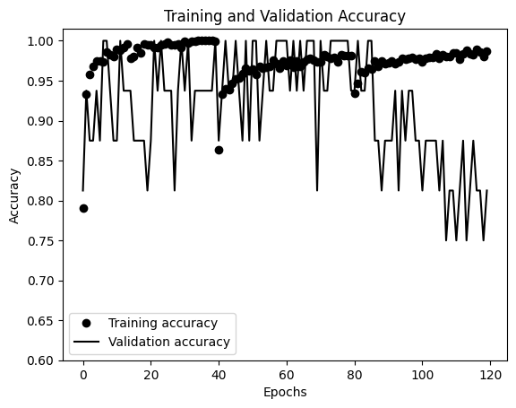
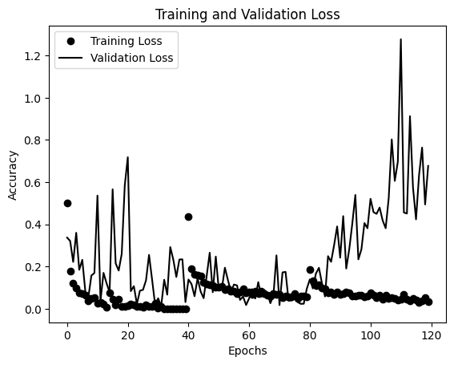
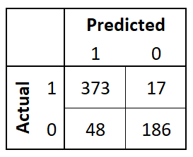

This neural network was originally based off of the VGG162014 neural network.

# Model
```
______________________________________________________________________
 Layer (type)					    Output Shape			Param #   
======================================================================
 rescaling_1 (Rescaling)			(None, 224, 224, 3)		0    
 conv2d_5 (Conv2D)				    (None, 224, 224, 64)    1792      
 max_pooling2d_5 (MaxPooling 2D)  	(None, 112, 112, 64)    0  
 conv2d_6 (Conv2D)                	(None, 112, 112, 128)   73856     
 max_pooling2d_6 (MaxPooling 2D)  	(None, 56, 56, 128)     0         
 conv2d_7 (Conv2D)                	(None, 56, 56, 256)     295168    
 max_pooling2d_7 (MaxPooling 2D)  	(None, 28, 28, 256)     0       
 conv2d_8 (Conv2D)                	(None, 28, 28, 512)     1180160 
 max_pooling2d_8 (MaxPooling 2D)  	(None, 14, 14, 512)     0      
 conv2d_9 (Conv2D)                	(None, 14, 14, 512)     2359808  
 max_pooling2d_9 (MaxPooling 2D)  	(None, 7, 7, 512)       0 
 flatten_1 (Flatten)              	(None, 25088)           0          
 dense_2 (Dense)                  	(None, 128)             3211392
 dropout_1 (Dropout)              	(None, 128)             0        
 dense_3 (Dense)                  	(None, 2)               258  
=====================================================================
Total params: 7,122,434
Trainable params: 7,122,434
Non-trainable params: 0
_____________________________________________________________________
```

# Preprocessing
This model was trained in 3 stages to overcome a limitation of a limited number of training samples. Prior to training, a different series of data augmentation was applied to the training dataset. 

| Training 	| Preprocessing                                	|
|:---------:|:---------------------------------------------	|
| 1        	| - Image Size: (224, 224) <br>- Rescaling: 1./255 	|
| 2        	| - Image Size: (224, 224) <br>- Rescaling: 1./255 <br>- Horizontal Flip: True <br>- Vertical Flip: True <br>- Random Rotation: 0.2|
| 3        	| - Image Size: (224, 224)<br>- Rescaling: 1./255<br>- Horizontal Flip: True<br>- Vertical Flip: True<br>- Random Rotation: 0.2<br>- Random Brightness: 0.3<br>- Random Contrast: 0.3 |

# Training
[vgg_1.ipynb](https://github.com/yoosufb/CECS456_FinalProject/blob/main/VGG_Samaniego/vgg_1.ipynb) is the file that contained the first stage of training. Within this file, the sequential model structure was defined and compiled. The model was then trained for 40 epochs and then saved to disk under the `tfmodel` dirctory. This training session resulted in an 80.13% testing accuracy with a loss of 4.5050. 

The [vgg_2.ipynb](https://github.com/yoosufb/CECS456_FinalProject/blob/main/VGG_Samaniego/vgg_2.ipynb) file contains the second training session. Within this file, the `tfmodel` was loaded directly from disk and then trained for another 40 epochs with the training session 2 preprocessing applied to the training dataset. Traing session 2 resulted in an 83.65% accuracy with a loss of 0.8558. After training, the model was saved again to disk under the `tfmodel_2` directory.

[vgg_3.ipynb](https://github.com/yoosufb/CECS456_FinalProject/blob/main/VGG_Samaniego/vgg_3.ipynb) contains the final training session. Once again, the model was loaded from disk and trained with the training session 3 preprocessing. The model was trained for another 40 epochs (total of 120 epochs) and resulted in a testing accuracy of 89.58% and a loss of 0.4725. The model was then saved to disk under the `tfmodel_3` directory. 






# Testing Results


* Accuracy: 89.6%
* F1: 92.0%
* Precision: 88.6%
* Recall: 95.6%

